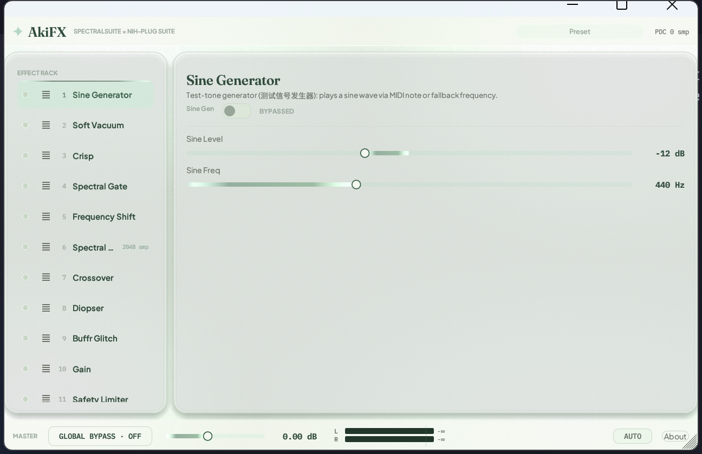
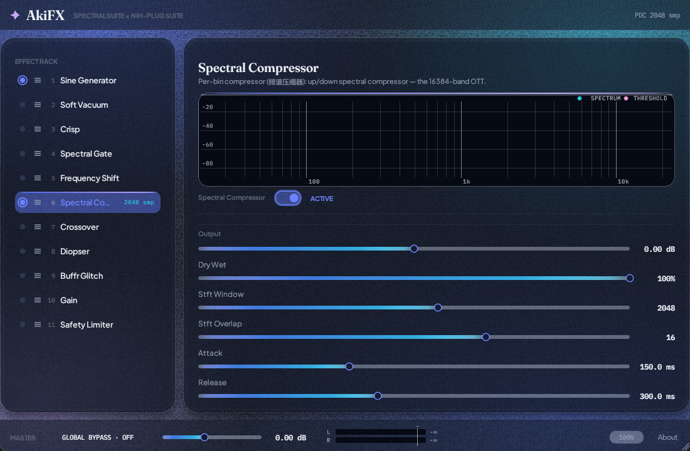

# AkiFX User Manual

*AkiFX — an all-in-one FX rack for Windows, in the Aki "Aurora Glass" design language.*



---

## 1 · Welcome

AkiFX bundles eleven effects into a single VST3/CLAP plugin and a standalone
application. Modules live in a rack you can reorder by dragging; every module
can be powered on or off independently; the whole chain has one global bypass
your DAW can automate.

This manual covers the interface, every module, and troubleshooting. A companion document, [TECHNICAL.md](TECHNICAL.md), explains
the underlying signal processing.

## 2 · Interface



| Region | What it does |
|---|---|
| Title bar | Brand mark; the **preset bar** slot (reserved); live **PDC** badge showing the chain latency in samples. |
| Effect Rack (left) | The 11 modules in processing order. Click a name to select it, click its LED to power it on/off, drag the grip (≡) to reorder. Keyboard: arrows move, Home/End jump. Latency badges (e.g. `2048 smp`) mark modules that delay the signal. |
| Module card (right) | The selected module's name, a one-line introduction, its power toggle with an ACTIVE/BYPASSED chip, and its parameters: sliders with gradient fill (bipolar ranges fill from the center), segmented selectors for enum choices, and pill switches for booleans. The Spectral Compressor adds a live spectrum panel with its threshold curve. |
| Footer | **MASTER** section: global bypass pill (glows while engaged), master gain slider, L/R output meters (−60…+6 dBFS with 0 dB reference, red above 0 dB, click to clear the clip latch), UI zoom, About. |

**Power semantics:** a dark LED means the module is bypassed and uses no CPU.
The global bypass in the footer mutes the entire effect chain (bit-identical
passthrough) while the plugin stays loaded — automatable from the host.

**Zoom:** the `%` button cycles 60–200%.

## 3 · Installation

1. Grab `AkiFX-v0.4.0-windows-x64.zip` from the [releases page](https://github.com/AkiroMusic/AkiFX/releases).
2. Copy `AkiFX.vst3` into your VST3 folder (`C:\Program Files\Common Files\VST3`), and/or `AkiFX.clap` into your CLAP folder (`C:\Program Files\Common Files\CLAP`).
3. `AkiFX.exe` is the standalone app — run it directly. It requests a 2048-sample WASAPI period internally so shared-mode audio devices do not trip oversized buffers.

**Building from source:** `cargo xtask bundle --release` produces the same artifacts under `target/bundled/`. Rust 1.74+ (MSVC toolchain) is required.

## 4 · Quick start

1. Insert AkiFX on a track.
2. Adjust the selected module's sliders; the spectrum panel on the Spectral Compressor shows exactly where the threshold sits against your signal.
3. Automate **Global Bypass** for A/B comparisons.

## 5 · Signal chain

Signal flows top to bottom in the rack order:

```
Sine Generator → Soft Vacuum → Crisp → Spectral Gate → Frequency Shift
  → Spectral Compressor → Crossover → Diopser → Buffr Glitch → Gain
  → Safety Limiter → output
```

Reordering the rack re-wires the chain; the number badge is the processing
position. Host delay compensation receives the sum of all powered modules'
latencies.

## 6 · Control reference

Common behavior: drag to set, double-click to reset a slider to its default,
mouse wheel to nudge (hold Shift for fine steps). Every parameter has a tooltip.

| Module | Parameters (range) | What it does |
|---|---|---|
| **Sine Generator** | Level (−30…+30 dB), Fallback freq (20 Hz–20 kHz) | Test tone for wiring checks and calibration; plays continuously, or follows MIDI notes with a 5 ms click-free envelope. |
| **Soft Vacuum** | Drive (0–2), Warmth (0–1), Aura (0–π), Output gain, Dry/wet, Oversampling (2×/4×/8×) | Airwindows Hard Vacuum tube saturation, oversampled to keep the harmonics clean. |
| **Crisp** | Amount, filter cutoffs/Qs, Output, Wet-only | Ring-modulator + filtered-noise exciter that adds high-frequency sparkle. |
| **Spectral Gate** | Cutoff, Balance, Tilt (+ Enable tilt) | Per-bin noise gate in the frequency domain — cleans hiss and hum without dulling the source. |
| **Frequency Shift** | Shift (Hz), Scale | Moves every FFT bin by a fixed offset — inharmonic metallic ring/modulation textures. |
| **Spectral Compressor** | Output, Dry/wet, STFT window/overlap, Attack/Release, Threshold (global/center freq/slope/curve), upward + downward ratio/knee/rolloff/sidechain link | 16384-band compressor; the built-in spectrum panel draws your signal against the threshold curve. |
| **Crossover** | Band count (2–5), 4 crossover frequencies, 5 band gains | Linkwitz-Riley IIR splitter with per-band level — tone shaping and multi-band feeding. |
| **Diopser** | Stage count, Cutoff, Resonance, Spread octaves, Spread style | Cascaded resonant filters; at high resonance the filter itself becomes the instrument. |
| **Buffr Glitch** | Dry mix, Velocity-sensitive, Octave shift, Attack/Release/Crossfade (ms) | MIDI-triggered buffer-repeat stutter. |
| **Gain** | Gain (−30…+30 dB) | Clean master gain stage. |
| **Safety Limiter** | Threshold | Brickwall guard so experimentation cannot hurt anyone. |

## 8 · Troubleshooting

- **No sound after loading** — every module ships bypassed. Check the module LEDs first, then the global bypass pill.
- **The meters move but levels look small** — meters are peak dBFS on a −60…+6 scale; the 0 dB tick is full scale, not the top of the bar.
- **Latency changed after reordering** — spectral modules delay by 2560 samples each (2048 FFT + 512 hop, conservative report). Your DAW's PDC uses the `PDC` badge value; leave plugin delay compensation enabled.
- **Standalone has no input** — inputs are never auto-connected (feedback protection); pick one explicitly with `--input-device` if you need to process a live source.
- **Plugin scan fails** — delete the `.vst3` folder and re-extract; a partial copy is the usual culprit.
- **The null test numbers** — with the spectral callback neutral, reconstruction error at the true delay is ≈ 4.7×10⁻⁴ (window ripple floor, ~1/FFT-size, inaudible). See TECHNICAL.md for the test inventory.

## 9 · Specifications

| | |
|---|---|
| Formats | VST3, CLAP, standalone (Windows x64) |
| Channels | Stereo in / stereo out (32-bit float) |
| Sample rates | follows host/device |
| Latency | 2560 samples per powered spectral module (Spectral Gate, Frequency Shift, Spectral Compressor); reported to host |
| Spectral engine | 2048-point FFT, 4× overlap, Hann window |
| Presets | preset bar slot reserved (table ships empty) |
| State | full parameter + module order + power state + UI zoom, saved by the host |
| License | GPL-3.0 (see LICENSE); bundled fonts under the SIL OFL |

---

# AkiFX 用户手册（中文）

*AkiFX —— Windows 平台的一体化效果机架，Aki「Aurora Glass」设计语言。*


## 1 · 欢迎

AkiFX 将十一个效果模块集成到一个 VST3/CLAP 插件与独立程序中。机架支持拖拽排序，每个模块可独立开关，整链另有全局旁路可供宿主自动化。本文介绍界面、每个模块、工厂预设与故障排查；底层实现见 [TECHNICAL.md](TECHNICAL.md)。

## 2 · 界面


| 区域 | 功能 |
|---|---|
| 标题栏 | 品牌字标；**预设栏**（‹ · 下拉 · ›）快速切换工厂预设；**PDC** 徽标实时显示整链延迟（采样数）。 |
| Effect Rack（左） | 按处理顺序排列的 11 个模块。点击名称选中，点击 LED 通电/断电，拖动 ≡ 手柄排序；方向键移动、Home/End 跳转。`2048 smp` 之类的延迟徽标标记会延迟信号的模块。 |
| 模块卡（右） | 选中模块的名称、一句介绍、电源开关与 ACTIVE/BYPASSED 状态；参数区为渐变滑杆（双极参数从中心填充）、枚举分段选择器、布尔药丸开关。Spectral Compressor 额外带频谱面板，实时叠加门限曲线。 |
| 底栏 | **MASTER** 区：全局旁路药丸（接通时流光呼吸）、主增益滑杆、L/R 输出电平表（−60…+6 dBFS，0 dB 参考线，超 0 变红，点击清除过载锁存）、界面缩放、About。 |

**电源语义**：LED 熄灭 = 模块旁路，不消耗 CPU。底栏的全局旁路让整链位一致直通，宿主可自动化。

**缩放**：`%` 按钮在 60–200% 之间循环。

## 3 · 安装

1. 从 [Releases](https://github.com/AkiroMusic/AkiFX/releases) 下载 `AkiFX-v0.4.0-windows-x64.zip`。
2. 将 `AkiFX.vst3` 复制到 VST3 目录（`C:\Program Files\Common Files\VST3`），或将 `AkiFX.clap` 复制到 CLAP 目录（`C:\Program Files\Common Files\CLAP`）。
3. `AkiFX.exe` 为独立程序，可直接运行；内部自动请求 2048 采样 WASAPI 周期，避免共享模式设备超大缓冲触发断言。

**从源码构建**：`cargo xtask bundle --release`，产物位于 `target/bundled/`。需要 Rust 1.74+（MSVC 工具链）。

## 4 · 快速上手

1. 在音轨上插入 AkiFX。
2. 打开标题栏预设下拉，选一个配方 —— 音色用 *Warm Saturate*，凝聚力用 *Drum Glue*，实验用 *Resonant Space*。
3. 调整对应模块滑杆；Spectral Compressor 的频谱面板会实时显示门限曲线相对信号的位置。
4. 自动化 **Global Bypass** 做 A/B 对比。

## 5 · 信号链

信号按机架顺序自上而下流动：

```
Sine Generator → Soft Vacuum → Crisp → Spectral Gate → Frequency Shift
  → Spectral Compressor → Crossover → Diopser → Buffr Glitch → Gain
  → Safety Limiter → 输出
```

拖拽排序即重新接线，数字徽标即处理位置。宿主 PDC 收到的是所有通电模块延迟之和。

## 6 · 控件参考

通用操作：拖动设定；双击恢复默认；滚轮微调（Shift 细步）；每个参数都有悬停说明。

| 模块 | 参数（量程） | 作用 |
|---|---|---|
| **Sine Generator** | 电平（−30…+30 dB）、Fallback 频率（20 Hz–20 kHz） | 测试信号源；持续发声，或跟随 MIDI 音符（5 ms 无爆音包络）。 |
| **Soft Vacuum** | Drive（0–2）、Warmth（0–1）、Aura（0–π）、输出增益、干湿、过采样（2×/4×/8×） | Airwindows Hard Vacuum 真空管饱和，过采样保持谐波干净。 |
| **Crisp** | Amount、滤波频率/质量因数、输出、仅湿 | 环形调制 + 滤波噪声激励器，补充高频光泽。 |
| **Spectral Gate** | Cutoff、Balance、Tilt（+开关） | 频域逐 bin 噪声门，去嘶声与哼声而不发闷。 |
| **Frequency Shift** | Shift（Hz）、Scale | 所有 FFT bin 整体搬移，产生非谐波金属质感。 |
| **Spectral Compressor** | 输出、干湿、STFT 窗口/重叠、启动/释放、门限（全局/中心频率/斜率/曲线）、上行+下行比率/拐点/高频滚降/侧链关联 | 16384 频带压缩器；内置频谱面板实时对照门限曲线。 |
| **Crossover** | 频带数（2–5）、4 个分频点、5 个频带增益 | Linkwitz-Riley IIR 分频 + 逐带电平。 |
| **Diopser** | 级数、Cutoff、共振、扩展倍频程、扩展方式 | 级联共振滤波器；高共振时滤波器本身即乐器。 |
| **Buffr Glitch** | 干信号混合、力度敏感、八度移位、启动/释放/交叉淡化（ms） | MIDI 触发的缓冲重复卡顿效果。 |
| **Gain** | 增益（−30…+30 dB） | 干净的主增益级。 |
| **Safety Limiter** | 门限 | 砖墙保护，放心实验。 |

## 8 · 故障排查

- **加载后无声** —— 所有模块默认旁路；先看模块 LED，再看全局旁路。
- **电平表数值偏小** —— 电平表是 −60…+6 的峰值 dBFS；0 dB 刻度是满量程，不是条顶端。
- **排序后延迟变化** —— 每个频谱模块延迟 2560 采样（2048 FFT + 512 hop，保守上报）。PDC 徽标即宿主应收到的数值；请保持插件延迟补偿开启。
- **独立程序无输入** —— 输入永远不会自动连接（防啸叫）；需要处理实时信号时用 `--input-device` 显式选择。
- **插件扫描失败** —— 删除 `.vst3` 目录重新解压；拷贝不完整是最常见原因。
- **零测试（null test）数值** —— 频谱回调中性时，真实延迟处的重构误差约 4.7×10⁻⁴（窗纹波底线，约 1/FFT 长度，不可闻）。测试清单见 TECHNICAL.md。

## 9 · 规格

| | |
|---|---|
| 格式 | VST3、CLAP、独立程序（Windows x64） |
| 声道 | 立体声入 / 立体声出（32-bit 浮点） |
| 采样率 | 跟随宿主/设备 |
| 延迟 | 每个通电频谱模块 2560 采样（Spectral Gate、Frequency Shift、Spectral Compressor）；已向宿主上报 |
| 频谱引擎 | 2048 点 FFT、4× 重叠、Hann 窗 |
| 预设 | 10 个工厂预设（只读），其余状态由宿主保存 |
| 状态 | 全部参数 + 模块顺序 + 电源状态 + 界面缩放 |
| 许可 | GPL-3.0（见 LICENSE）；内置字体采用 SIL OFL 许可 |
